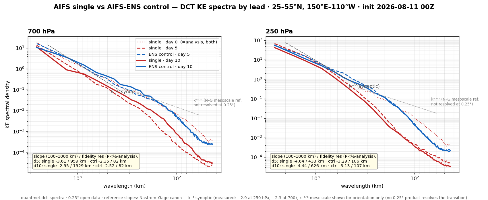
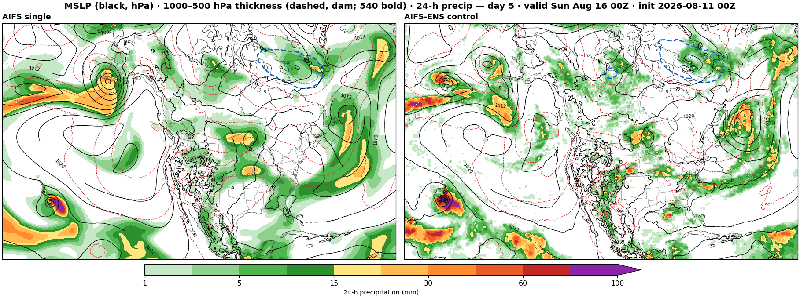

# Case study: AIFS single vs AIFS-ENS control — spectral fidelity by lead time

`quantmet.dct_spectra` applied to a question few have asked publicly: **does
ECMWF's deterministic AIFS blur faster than the AIFS-ENS control member?**
Both are 0.25° open-data products from the same 00Z analysis; one is trained
on an MSE-type objective, the other on an ensemble/CRPS-type objective.

DCT kinetic-energy spectra over a 25–55°N Pacific–North America box,
init 2026-08-11 00Z (dotted = analysis, identical for both by construction):

| lead | level | AIFS single | AIFS-ENS control |
|---|---|---|---|
| day 5 | 700 hPa | slope −3.61 · fidelity res 959 km | slope −2.35 · fidelity res 82 km |
| day 10 | 700 hPa | −2.95 · **1929 km** | −2.52 · 82 km |
| day 5 | 250 hPa | −4.64 · 433 km | −3.29 · 106 km |
| day 10 | 250 hPa | −4.44 · 626 km | −3.13 · 107 km |

**Fidelity resolution** (`quantmet.dct_spectra.fidelity_resolution`): the
finest wavelength at which a forecast still carries ≥50% of its own
*analysis* spectral density. Unlike dissipation-range criteria it is defined
for any forecast, and it measures scale-dependent energy loss directly. A
fair objection — a day-10 spectrum may legitimately differ from day 0 because
the *weather* changed — answers itself here: both models rode the same
regime, and the control held the analysis spectrum to ~100 km throughout, so
the atmosphere's spectrum was quasi-stationary and the single's departure is
model smoothing, not meteorology.

The deterministic model slides toward an ensemble-mean-like state — MSE
rewards hedging, so unpredictable scales are averaged away, progressively and
apparently without bound. The CRPS-trained control keeps a quasi-stationary,
realistic spectrum ten days in: uncertainty lives in the ensemble spread, not
in per-member smoothness.

The same signature in physical space — MSLP / 1000–500 thickness / 24-h
precipitation at day 5, single (left) vs control (right); note the texture of
the precipitation fields:

A note on the reference slopes: the Nastrom–Gage canon puts k⁻³ at synoptic
scales and k⁻⁵/³ in the mesoscale, but **no 0.25° product resolves the
mesoscale transition** — the measured synoptic slopes here are −2.9 (250 hPa)
and −2.3 (700 hPa), and everything below ~150 km is dissipation tail. The
−5/³ guide is drawn for orientation only.

Practical corollaries: past ~a week, read a single-AIFS chart as a smoothed
consensus rather than a weather realization; and any diagnostic quadratic in
the fields (E–P flux, wave-activity flux, eddy statistics) should be computed
from ensemble members, never from the blurred deterministic run. Whether the
control can simply *replace* the single for deterministic use — it arrives
only minutes later — is an open verification question this repo's owner is
now tracking operationally.

Reproduce: `python spectra_by_lead.py` (fetches ~10 MB of open data).
